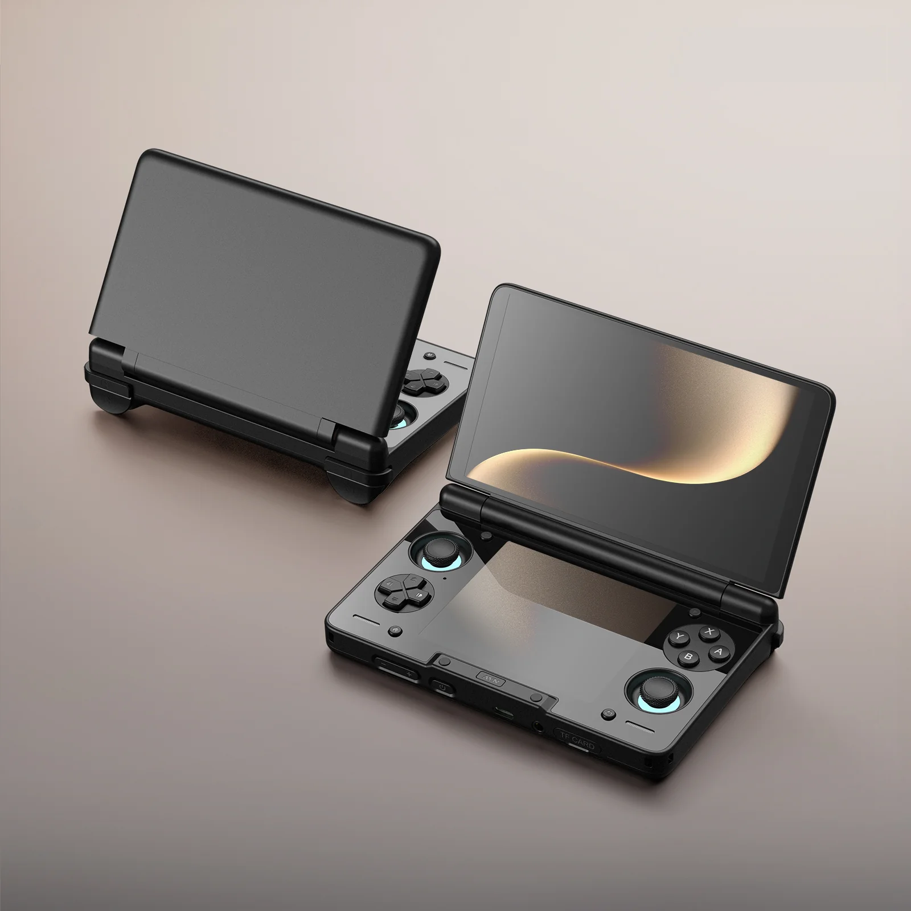
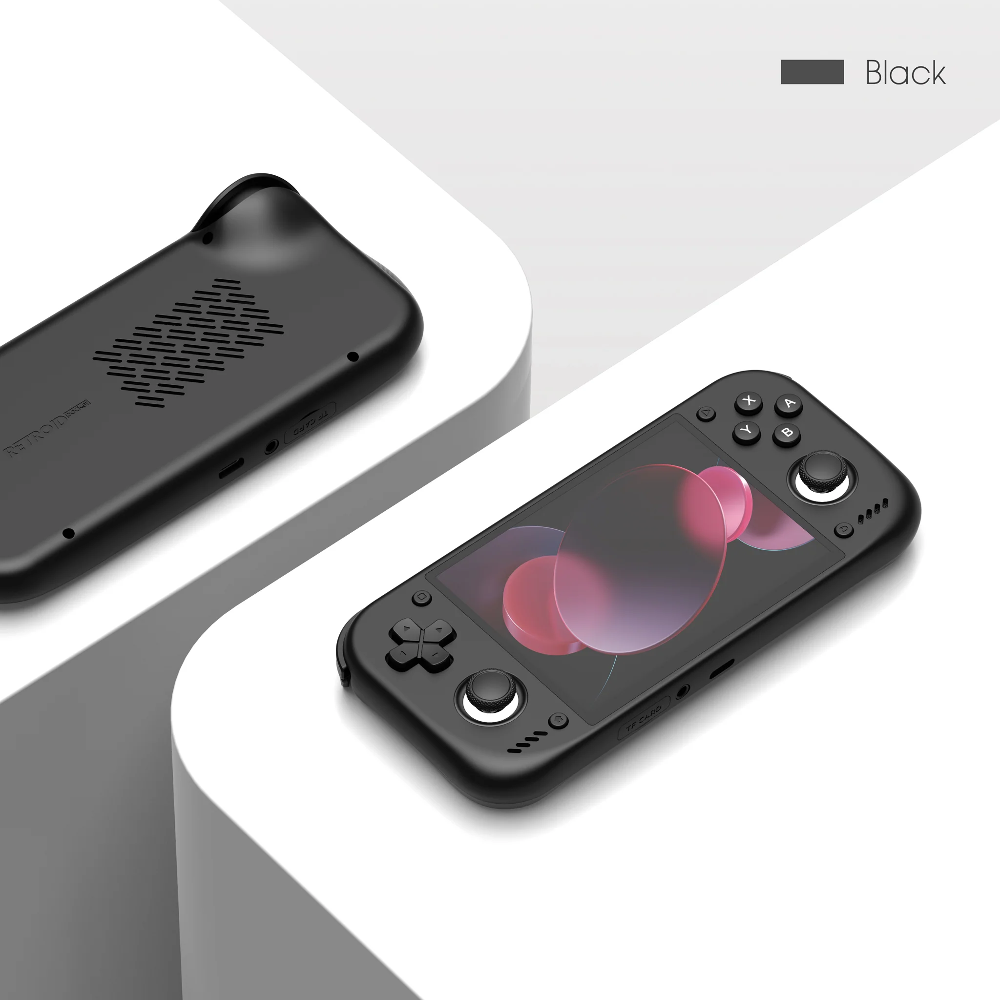

# Android Handheld

  
   
  <em>AYN Thor (2025) 12GB + 256GB</em>

  
   
  <em>Retroid Pocket Nova (2026) 12GB + 128GB</em>

## Accessories
- **Micro SD Cards:** SanDisk Extreme PRO microSDXC UHS-I CARD 
- **Micro SD Card Reader:** SanDisk QuickFlow microSD Card Reader with USB-C
- **Power Bank:** Anker Prime Power Bank (26K, 300W)
- **Headphones:** Apple AirPods Pro 3
- **Cable:** Silkland USB-C Monitor Display Cable
- **Charger:** Anker Prime Charger (160W, 3 Ports, Smart Display)
- **Portable:** Samsung Portable SSD T9 USB 3.2 Gen 2x2

## Applications

### Google Play Store
- **Music:** Spotify
- **Browser:** Brave Browser
- **Text Editor:** QuickEdit Text Editor Pro
- **File Manager:** MiXplorer File Manager
- **Cloud Gaming:** GeForce Now
- **Download Manager:** 1DM+
- **Battery Monitor:** AccuBattery

### F-Droid (+ IzzyOnDroid)
- **Local File Sharing:** LocalSend
- **Android Debloater:** Canta
- **APK Manager:** Obtainium, App Manager
- **System Monitor/Cleaner:** SD Maid 2/SE
- **System Utilities:** Shizuku (thedjchi fork)
- **Terminal Emulator:** Termux

### Morphe
- YouTube
- AdGuard
- Gboard

### Obtainium

#### Sources
- [Morphe/Piko Obtainium Guide](https://wispydocs.pages.dev/morphe-piko-obtainium/)
- [Obtainium Emulation Pack](https://github.com/RJNY/Obtainium-Emulation-Pack)

#### Emulator
- RetroArch (Nightly)
- Azahar
- PICO-8
- PPSSPP
- WatermelonDS
- ARMSX2
- Dolphin Emulator
- Eden (Nightly)

#### Frontend
- iiSU

#### PC Emulation
- GameNative

#### Track Only
- Mr. Purple Turnip Drivers
- Obtainium Emulation Pack

#### Utilities
- ClusterTune
- Pixel Guide
- Syncthing-Fork
- Nova Display Calibration

#### No category
- MicroG RE
- Obtainium

## Set Up

TBD
